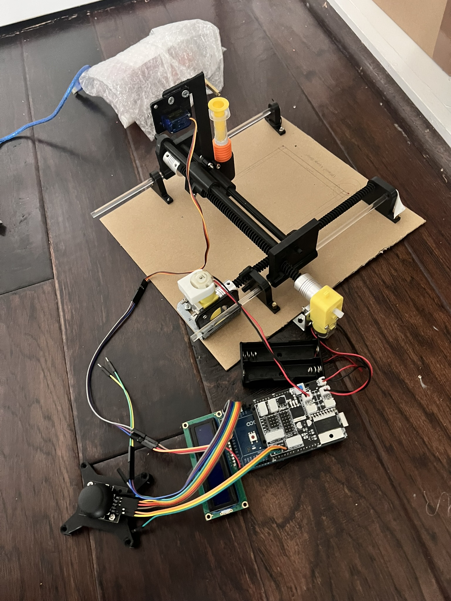
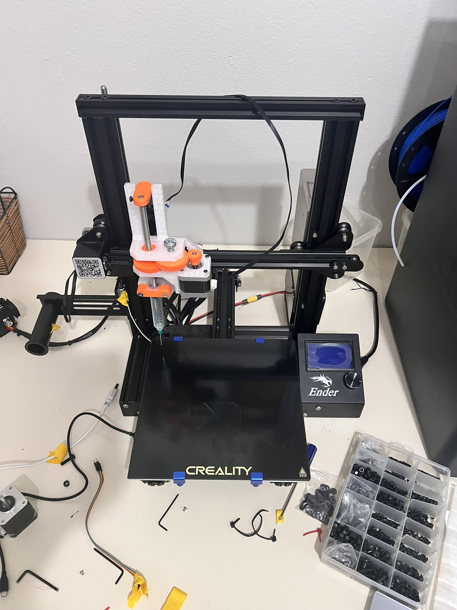
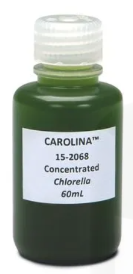
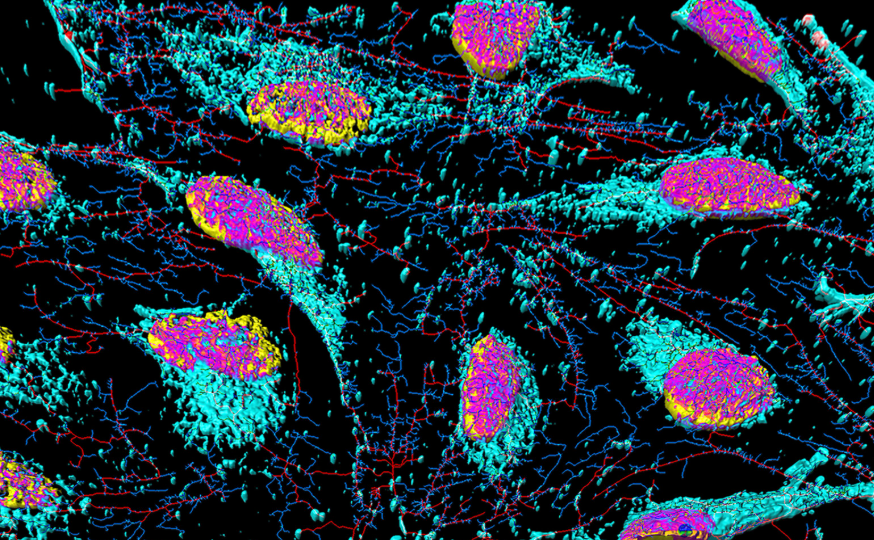

After placing third in the state and not advancing to ISEF, I wanted to build something that would allow me to make it there next year. What I came up with was this project: a DIY low cost bioprinter.

[BOM / Parts List](expenses.csv)

[Todo list / Agenda](plan.md) Note: (This will be replaced with a full instruction manual later, but as I am still iterating and changing the way I want to do this, I have included this file temporarily. This file is my thoughts on what the next steps for this project should be, and detailed info on what I am working on currently.)

[Media/Images](media) Images of the project will be uploaded here as they are taken.

What's happened so far?:

- Researched what bioprinting was to make sure it was the right fit for me  

- Built an arduino mega based cardboard prototype of a bioprinter alongside a custom gcode interpreter and custom arduino OS  

- Bought a used ender 3 pro and made a custom hotend mounting system, designed a custom paste extruder, modded the dimensions, installed a glass bed, and other mods; created a custom cura profile, made a klipper .cfg file, researched installation methods for klipper, made an agenda  

What's to come?:

- Complete modding the bioprinter
- Test the paste extruder with a gelatin and water mix; start tuning the print variables on this to not waste the more expensive final bioink
- Print with a bioink comprised of Chlorella Vulgaris (type of algae), Sodium Alginate (thickener, gives the consistency required to print the bioink), and Calcium Chloride (spray onto printed layers to make them stiff enough for the next layer to be printed on top). [Detailed Explanation for why this works](bioprinting/research/bioink.md)

- Perhaps (not decided yet), print tissues with 3T3 cells (mouse) or HeLa cells (Human), if all previous steps are completed with enough time to allow for experimentation with more advanced cells.  

