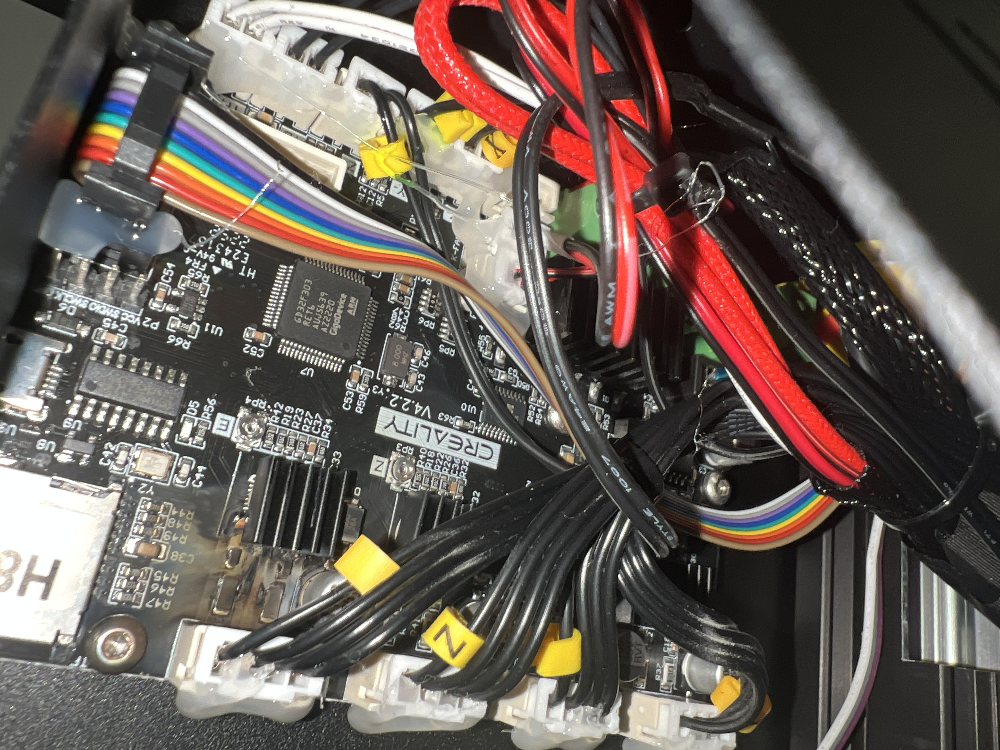
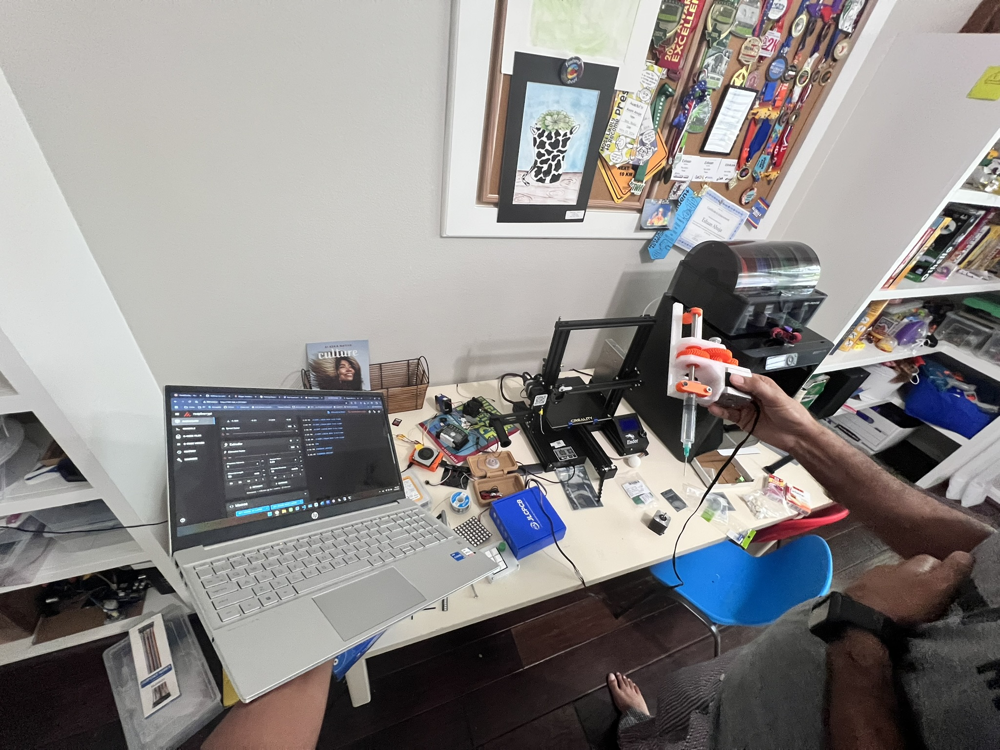

<h2>Project Timeline</h2>
<h3>Segment 1 - Complete</h3>

  

    

    
<strong>1 - complete</strong> <small>Research bioprinting and its feasibility</small>

  

  

  

    

    
<strong>2 - complete</strong> <small>Build a working <a href="media/aerial_view_cardboard_prototype_FINAL(1).JPEG">cardboard prototype</a></small>

  

  

  

    

    
<strong>3 - complete</strong> <small>Design and <a href="media/post_ender_mod_documentation (1).JPEG">build</a> a bioprinter based on an Ender 3 Pro</small>

  

<h3>Segment 2</h3>

  

    

    
<strong>4 - complete</strong> <small>Install Klipper and perform a <a href="">dry run</a></small>

  

  

  

    

    
<strong>5</strong> <small>Print a cube out of gelatin to perform the majority of the tuning</small>

  

  

  

    

    
<strong>6</strong> <small>Print a leaf out of algae and test its ability to perform photosynthesis</small>

  

<h3>Segment 3</h3>

  

    

    
<strong>7</strong> <small>Research the ISEF regulations on animal/human cells;  research if they could be printed on my printer and form a tissue</small>

  

  

  

    

    
<strong>8a</strong> <small>Print tissue out of 3T3 (mouse) cells and check for life</small>

  

  

  

    

    
<strong>AND/OR 8b</strong> <small>Print tissue out of HeLa (human) cells and check for life</small>

  

Since my printer caught fire during my first attempt at getting a physical gcode running and burnt the extruder motor driver (Note: this is a great experience to talk about when judges want to hear about challenges during the ideation phase), I thought it would be a good idea to step back and look at where I want to go next.

    

        <h5 style="margin-top: 0;">Burnt mobo</h3>
        
    

    

        <h5 style="margin-top: 0;">From left to right: mainsail on laptop, pi with external motor driver, bioprinter, paste extruder powered by external motor driver</h3>
        
    

### What has been done so far:

Firstly, I removed whatever OS is currently loaded on the board's internal EEPROM and Memory (Which seems to be a version of Marlin, but which version I cannot be entirely sure of) and replaced it with a custom Klipper version, complete with proper cold extrusion support and allowing for the correct way to reverse the extruder motor, instead of the janky way that I tried to do it earlier, which resulted in the aforementioned fire. I then installed a build of Moonraker and Mainsail on the Raspberry Pi, flashed the Klipper file from that OS onto the modded Ender 3 Pro turned bioprinter, flashed another version onto the Raspberry Pi Zero, making two hosts for the Ender so that the signals intended for the burnt motor driver go through an external motor driver wired through the raspberry pi.

Todo list summary from the previous paragraph:

- [x] Install a build of Klipper, Moonraker and Mainsail
- [x] Add the printer .cfg file from below
- [x] Flash the Klipper .bin file from Mainsail OS onto the modded Ender 3 Pro turned bioprinter
- [x] Flash the Klipper .bin file from Mainsail OS onto the pi as the second mcu
- [ ] Start printing bioink!
- [ ] Finish all ECs, internships, etc.
- [x] Activate Github's Microsoft Azure free credit through the Student Developer pack for students 13-17
- [ ] Learn how to use Microsoft Azure
- [ ] Move the Vikunja instance to Microsoft Azure and reconnect it to the Cloudflare instance
- [ ] Move the Jellyfin instance into a docker container on the Synology DS212 2TB

Modifications to made to the Klipper profile from a stock Ender 3 Pro profile:

- [x] Cold extrusion
- [x] Change the Z height to account for the movement of the end stop to allocate for the increased size of the new toolhead
- [x] 0.8 mm nozzle size (the actual nozzle is 0.83mm in diameter, but the value of 0.8mm is easier for slicers to work with. I can tune out the difference through flow rate, line thickness, etc.) [CHANGED LINE 65]
- [x] Reverse the extruder motor [CHANGED LINE 61]
- [x] Change every movement (X, Y, and Z, not E) speed to max 5mm/s [completed in Cura]
- [x] Change extruder pins to rpi gpio pins
- [x] incl. mainsail cfg
- [x] pi as second mcu

Once I installed MainsailOS/Klipper on the Raspberry Pi of choice (see the .txt files in the "Klipper" directory), the plan to prevent another fire or severe accident would be to put the compiled Klipper OS for the printer on the SD card. This way, when I turn on the printer for the first time after the accident, the Klipper code will immediately replace the currently running marlin instance, preventing the execution of my accidentally malicious code that caused the fire because I will overwrite it before it has a chance to execute.

Before testing with material in the extruder, I first ran a ~30min dry run ([.gcode here](Klipper/cube_sliced_bioprinter.gcode); [Cura .3mf here](Klipper/cube_sliced_bioprinter.3mf)) to make sure that all motion axis and the klipper configuration were working well, before trying to actually print. In essence, I ran the print that I would have ran with gelatin without the gelatin to make sure everything worked before i added additional complexity. The only issue that I discovered was an error during the setup of the external motor driver, which was sending ~3.5 Amperes while the motor was expecting between 1 Ampere and 1.2 Amperes. After modifying the configuration of DIP switches on the rear of the unit, I was able to correct this error and proceed before any damage occurred to the motor. Besides this, the dry run went swimmingly, which puts us on track for gelatin testing once documentation is complete.

### All of the above has been done; everything below is to be done.

Once Klipper is running and the dry run is complete, the next step is testing with a gelatin and water mix. Before the fire, we saw that the printer successfully ran customized files, such as this [intestinal wall tissue](https://3d.nih.gov/entries/520) from the US National Library of Health, sliced in Cura, which, alongside a higher z endstop preventing the nozzle from crashing into the bed, would allow for testing with a gelatin and water mix to be able to happen immediately, if I fixed the issue of the extruder motor moving in the wrong direction. The reason the motor was moving in the wrong direction was that, during the installation of the M8 bolt that drives the central extrusion rod, I placed the bolt upside down in the slot due to a lack of consideration of the rod's movement direction. Due to this, the pole moved upwards during extrusion, a simple fix in Klipper but not so simple in the version of Marlin running on the bioprinter at the time. Now that I know that experimenting with Marlin settings instead of just biting the bullet and installing Klipper, a firmware that allows for much more customization, was the problem that led to the fire, I have gone ahead and written this file to prevent any more lapses in judgment from happening. Every significant step from here on out will be written in this document, allowing for better documentation and the prevention of logical errors that I could have avoided with more time spent contemplating the problem. Now that I have corrected the extrusion direction in the .cfg file, it is time to proceed to the next step: tuning the printer for printing a gelatin and water solution.

In theory, the printing of a gelatin and water solution is simple. Firstly, heat the solution of gelatin(~10g) and water (~50mL) till it reaches about $45\degree c$ (ideal extrusion temps are 35 to 45 $\degree c$), upon which it will transform into a gelatinous liquid that I can insert into the extruder by placing it below the orifice and reversing the extruder, effectively sucking up the liquid. While it is warm, I can extrude it like any other filament, and it will cool on the plate in ~30 seconds, allowing for the next layer to print on top. To prevent the cooling of the gelatin mix inside the syringe, I will add a solution later, but first, I would like to experiment with seeing how long the gelatin takes to cool; then, I can DIY a solution (such as an Arduino with a relay that heats a wire wrapped around the syringe, powered by a 12v battery, or a hairdryer mount that blows warm air onto the syringe without disturbing the print, possibly through a funnel or other system to direct the air current) and write it here. If it takes long enough to cool, it might be smarter to run small prints instead.

Now that I have went ahead and tested cooling, I am able to see that keeping the gelatin warm and liquid isn't the problem here, as it stays in liquid form for a few hours after formation; the actual problem is getting it to solidify enough for the next layer to be printed on top. Since a 4mm thick glass build surface is able to retain the temperatures from the freezer its been chilling in for up to 40 minutes, it is strategic to first chill the build plate, allow it to adjust to room temp during the startup of the printer, then print on the cold plate to allow for easy solidification of the first few layers. Since I aim to print tissue, which is not very thick, this should be an effective solution. 

Any additional waste products or failed prints can be reheated into liquid form and reprinted, allowing for testing without wastage. The purpose of this step is to allow for tuning within a range of the actual bioink that will be used in the final product to prevent the waste of the final product for tuning purposes when you could use a $2.99 gelatin mix to tune instead. (Note: keep the temp below 60°C (140°F) to avoid breaking it down.)

Additionally, I am also planning on making a full CAD design of the current bioprinter for use in renders and to aid in board creation. 
